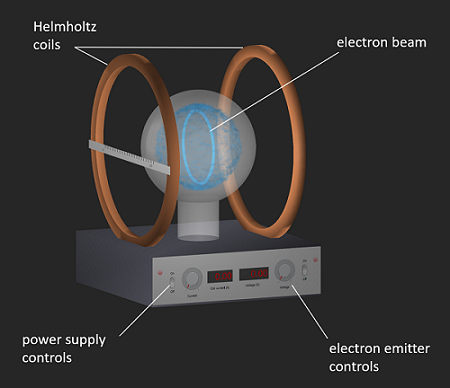

# Virtual Measurement of the Electron to Mass ratio 

 or 

**Curriculum Module**

_Created with R2021a. Compatible with R2024a and later releases._

# Information

This curriculum module contains interactive [MATLAB® live scripts](https://www.mathworks.com/products/matlab/live-editor.html) and [MATLAB® app](https://www.mathworks.com/products/matlab/app-designer.html) that follow J.J. Thomson’s landmark experiment to measure the charge to mass ratio of the electron, e/m. 

## Background

The app is a virtual replacement for the experimental apparatus commonly used in physics laboratories. The live script contains a manual for conducting the experiment. This lab includes background, pre\-lab, virtual experiment, and data analysis sections and concludes with an application of the theory to mass spectrometry.

The instructions inside the live scripts will guide you through the exercises and activities. Get started with each live script by running it one section at a time. To stop running the script or a section midway (for example, when an animation is in progress), use the  Stop button in the **RUN** section of the **Live Editor** tab in the MATLAB Toolstrip.

## Contact Us

Contact the [MathWorks teaching resources team](mailto:onlineteaching@mathworks.com) if you would like to provide feedback, or if you have a question.

## Getting Started
### Accessing the Module
### **On MATLAB Online:**

Use the  link to download the module. You will be prompted to log in or create a MathWorks account. The project will be loaded, and you will see an app with several navigation options to get you started.

### **On Desktop:**

Download or clone this repository. Open MATLAB, navigate to the folder containing these scripts and double\-click on [virtual\-measurement\-of\-the\-electron\-charge\-to\-m.prj](https://matlab.mathworks.com/open/github/v1?repo=MathWorks-Teaching-Resources/Virtual-Measurement-of-the-Electron-Charge-To-Mass-Ratio-Lab&project=virtual-measurement-of-the-electron-charge-to-m.prj&file=README.mlx). It will add the appropriate files to your MATLAB path and open an app that asks you where you would like to start. 

Ensure you have all the required products (listed below) installed. If you need to include a product, add it using the Add\-On Explorer. To install an add\-on, go to the **Home** tab and select   **Add-Ons** > **Get Add-Ons**. 

## Products
-  MATLAB® 
-  Curve Fitting Toolbox™ 
-  Symbolic Math Toolbox™ 

# Scripts
## [**emLab.mlx**](https://matlab.mathworks.com/open/github/v1?repo=MathWorks-Teaching-Resources/Virtual-Measurement-of-the-Electron-Charge-To-Mass-Ratio-Lab&project=virtual-measurement-of-the-electron-charge-to-m.prj&file=Scripts/emLab.mlx)
|      |      |
| :-- | :-- |
|     | **In this script, students will...**   $\bullet$ Explain the forces present in the experimental apparatus   $\bullet$ Derive the physical relationships required to compute the e/m ratio   $\bullet$ Relate the underlying theory to mass spectrometry     |
|      |       |

# Related Courseware Modules

Feel free to explore our other [modular courseware content](https://www.mathworks.com/matlabcentral/fileexchange/?q=tag%3A%22courseware+module%22&sort=downloads_desc_30d).

# Educator Resources
-  [Educator Page](https://www.mathworks.com/academia/educators.html) 

# Contribute 

Looking for more? Find an issue? Have a suggestion? Please contact the [MathWorks teaching resources team](mailto:%20onlineteaching@mathworks.com). If you want to contribute directly to this project, you can find information about how to do so in the [CONTRIBUTING.md](https://github.com/MathWorks-Teaching-Resources/Virtual-Measurement-of-the-Electron-Charge-To-Mass-Ratio-Lab/blob/release/CONTRIBUTING.md) page on GitHub.

 *©* Copyright 2024 The MathWorks™, Inc

